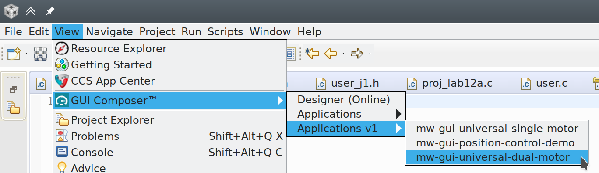
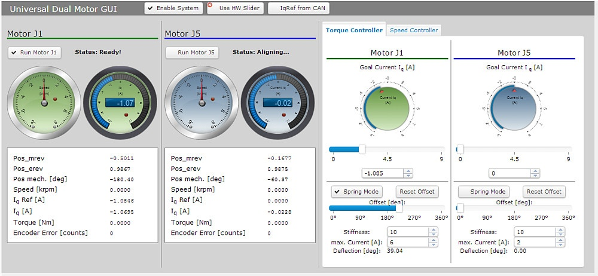
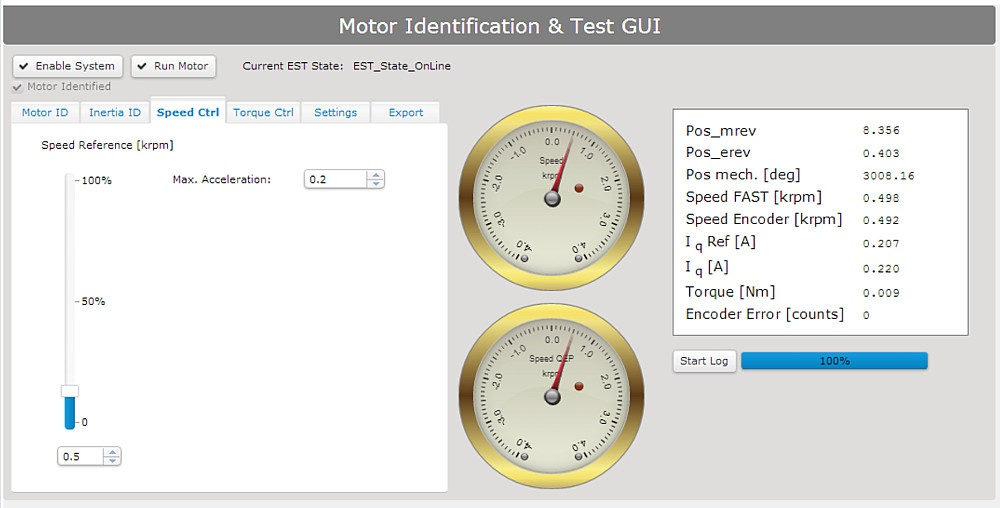

***************************************
GUIs for Testing Motor Control Firmware
***************************************

This repository contains GUIs that can be used inside `Code Composer Studio`_
(CCS) to do some basic tests with the motor control boards running the `Dual
Motor Torque Control firmware`_ (e.g. to check if motors are connected
correctly).

In recent versions of CCS the "GUI Composer Designer" add-on, which was
used to create the GUIs, is not supported anymore.  However, there is still a
"Runtime" add-on which still allows using the GUIs.

Below are instructions on how to setup the runtime add-on to use the GUIs, which
works for recent versions of CCS.  If you want to edit them, see
`instructions for GUI Composer Designer v1 <doc/gui_composer_designer_v1.rst>`_.

GUI Composer 1 Runtime
======================

While the **GUI Composer Designer v1** is not available anymore for CCS >6.1.2,
there is still the **GUI Composer Runtime v1** with which existing GUIs can
still be used.

Installation
------------

Open the CCS App Center (Menu: Help > CCS App Center), search for "GUI Composer
Runtime v1" and install it.

Location of GUIs
----------------

Unfortunately the Runtime expects the GUIs to be located at a different place
than the Designer.  The Runtime is looking for them in the directory "webapps"
inside the CCS installation directory (e.g. ``~/ti/ccs910/ccs/webapps``, but
will depend on where you installed CCS. The "webapps" directory may not be
created automatically, in this case create it manually inside the
``ti/ccs910/ccs`` folder). To use the GUIs they have to be copied or symlinked there:

.. code-block::

    git clone https://github.com/open-dynamic-robot-initiative/mw_gui_universal.git
    cd ~/ti/ccs910/ccs/webapps  # path will be different depending on the version and how you installed it.  Search for the "webapps" folder.
    ln -s path_to/mw_gui_universal/dual_motors .
    ln -s path_to/mw_gui_universal/single_motor .

Running a GUI
-------------

When the GUIs are placed at the correct directory, they should be listed in the
menu "View > Gui Composer > Applications v1". Simply select a GUI from there to
execute it.

Available GUIs
==============

Universal Dual Motor GUI
------------------------

Can be used with several dual motor applications that are based on the InstaSPIN
examples (most imporant our `Dual Motor Torque Control firmware`_). There are
different tabs for different applications (e.g. "Torque Control", "Velocity
Control"). Note that usually only some of them can be used, depending on the
program that is running on the board.

Universal Single Motor GUI
--------------------------

Same as above but for single motor applications.

.. _Code Composer Studio: https://www.ti.com/tool/CCSTUDIO
.. _Dual Motor Torque Control firmware: https://github.com/open-dynamic-robot-initiative/mw_dual_motor_torque_ctrl
