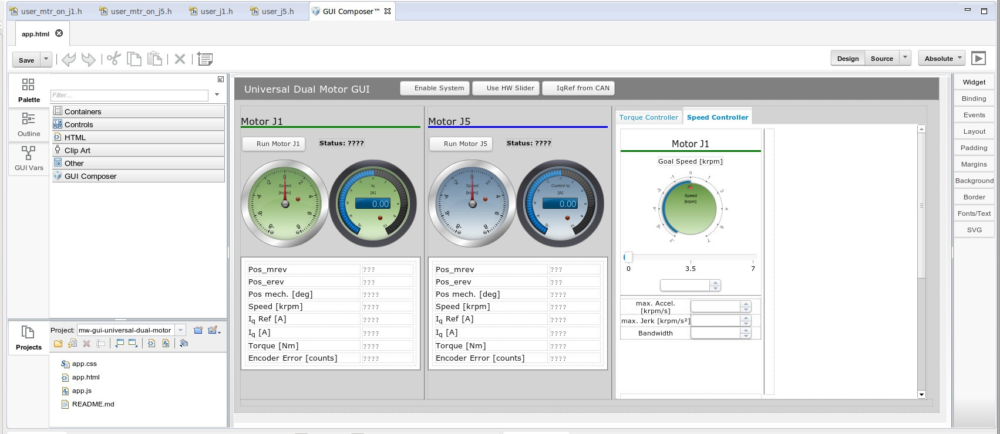

************
GUI Composer
************

GUI Composer is a tool by Texas Instruments that allows to easily (more or
less...) create GUIs to display information about the board (e.g. status,
position, velocity, torque of the the motors, etc.) and to send commands to the
board (e.g. enable motor, change controller reference values, etc.). This is
done by binding elements of the GUI, e.g. a slider, to global variables in the
program that is running on the board. The slider will then show the current
value of this variable and by moving the slider manually, this value can
directly be modified.

For the GUI to be able to connect to the board, the board has to be connected
via USB and to be run in debug mode.

While the GUI is quite limited, it is a great tool for debugging and simple
demos.

About Versions
==============

Our GUIs are created with GUI Composer 1. GC 1 is implemented as a Add-on for
Code Composer Studio and can be installed via the CCS App Center. Being
integrated into CCS it can easily be used while running the debugger and nicely
complements the Expressions view. **But:** Unfortunately the GUI Designer is not
included anymore in the newer CCS releases. So if you want to use this version
of GC, you have to stick to CCS 6.1.2. However, the Runtime is still available,
so existing GUIs can still be used (see `README <../README.rst>`_).

The new GUI Composer 2 is not integrated into CCS anymore but is a purely
cloud-based application that can only be used online via the browser.
Unfortunately, old GUIs, created with version 1, cannot be imported.

Due to the compatibility issues, it is recommended to use the old GC 1 only as a
legacy tool to run the old GUIs but use GC 2 when creating new ones.

GUI Composer 1 Designer
=======================

Installation
------------

GUI Composer 1 is integrated as an add-on into CCS. It is not supported anymore
by CCS 6.2+, so if you want to use it, you have to stick with 6.1.2.

It can be installed by selecting it during installation of CCS or via the "CCS
App Center" which can be reached inside CCs via "Help > CCS App Center".

Location of GUIs
----------------

To be able to open the GUIs in GUI Composer, they need to be stored in a
folder ``.GUIComposerWS`` inside your CCS workspace.

To run the GUI, start CCS and inside CCS start GUIComposer (hidden in the "View"
menu). It will open as a tab in the editor view:

To switch between GUIs, use the dropdown menu in the Projects section at the
bottom left.

When only adding a single GUI, it may not show up here. For some unknown reason,
there have to be at least two GUIs for them to show up... (i.e. simply clone
another one, even if you don't intend to use it).

Open GUI Composer
-----------------

To open GUI Composer, go to "View > GUI Composer". It will then open as a tab in
the editor view.

Creating a GUI
--------------

Create a new project in GUI Composer (not to be confused with the CCS projects,
they are completely unrelated). Now you can construct your GUI by
dragging widgets from the Palette menu and adjusting their properties in the
pane on the right. With the "**Design \| Source**" buttons on the top right you
can toggle between WYSIWYG mode and directly editing the underlying HTML code
(which is often better to get widgets to the desired position).

Binding Variables to GUI Widgets
--------------------------------

**Important:** Only widgets from the "GUI Composer" section in the Palette can
be bound to variables of your program! Otherwise identical widgets from other
sections can not be bound.

First select the widget in the GUI, then go to the "Binding" menu on the right.
Here you can bind variables to different properties of the widget. To bind a
variable, just type its name in the corresponding field.

Binding Q-Values
~~~~~~~~~~~~~~~~

When directly binding a variable that contains a Q-value, it will be shown in
its integer form which won't be useful in most cases. Instead bind to
``Q(variable_name, q_number)``. Example: ``Q(gMotorVars.SpeedQEP_krpm, 24)``.

Pre/Post Processing
~~~~~~~~~~~~~~~~~~~

There is a simple way to process values before using them in the GUI (pre
processing) or before sending them from the GUI to the program (post
processing). In the Binding menu click the [...] button next to the variable
field. This opens a window which allows to define a format string, which is used
to display the value, as well as pre and post processing functions. Simply
select an existing function from the drop down menu or enter a new function name
and hit enter. This will automatically add the function definition to the file
app.js.

Binding to Expressions
~~~~~~~~~~~~~~~~~~~~~~

It is also possible to bind a widget not to a single variable but to an
expression like ``var1 + var2``. Note that in this case the widget becomes
readonly.

Running GUI inside CCS
----------------------

To run a GUI during development, just click the preview button on the top right
(|preview_button|). The GUI will run inside CCS and automatically connect to a
running debug session.

Sometimes there arise strange problems, when one GUI instance is used over
multiple debug sessions. To avoid these, it is good practice to always restart
the GUI preview when restarting the program on the board.

**Known issue on Linux:**
There is a known issue that after exiting the Preview Mode, the GUI Composer
does not load again and the tab only shows white emptiness. To fix this, switch
to another Perspective of CCS (e.g. from Edit to Debug), then the GUI should be
there again.

Running GUI as Stand-alone Application
--------------------------------------

To run a GUI together with the micro controller program outside of CCS, export
the GUI by clicking the "Export Project" button (|export_button|) in the
projects section (bottom left). In the following dialog select destination
location for the exported file, micro controller device and connection type. As
"Program File" select the ``*.out`` file of the corresponding CCS project (i.e.
the program that will run on the micro controller).

Make sure you have the GUI Composer Runtime installed (can be downloaded `from
the TI website <http://www.ti.com/tool/instaspinuniversalgui>`__). Extract the
exported ZIP file to the subdirectory **webapps** of the GUI Composer Runtime
(with default installation under Windows this will
be ``C:/ti/guicomposer/webapps``). **If you store your GUI somewhere else, the
launcher will not work!**

Now you can easily run the GUI together with the exported program by starting
the launcher (i.e. no need to have a CCS debug session).

Debug GUI
---------

When running the GUI, it won't show any error messages when there are syntax
errors in the javascript code. It is, however, possible to attach the debugger
of an chromium-based browser while the GUI is running. This feature has first to
be enabled, though:

1. Open the file ``C:/ti/ccsv6/eclipse/ccstudio.ini`` and add the
   following line (you can choose any other free port instead of 8080):
2. Now start CCS and run GUI in preview mode
3. Open chromium-based browser and go to ``localhost:8080``
4. Click on the "GUI Composer - Preview"-link to open the attached debugger
5. **Important:** To be able to access variables/functions of app.js and things
   like ``$TI`` in the console, select "previewFrame( app.html )" instead of
   "<top frame>" in the drop-down menu at the bottom.

Sources: [3,4]

Known Issues
------------

-  Always restart the GUI when you restart the software on the board. If you
   don't do so, you will get some strange problems sooner or later.
-  Sometimes GUI Composer does not let you switch between GUIs anymore. In this
   case simply restart GUI Composer
-  When editing the GUI, occasionally some parts will change, where you did not
   actively do anything (no cure here, just make sure you catch and fix the
   unwanted changes):

   -  Toggle Buttons may lose their icon
   -  Pre-/Postprocessing functions of variable bindings may get lost

-  Sometimes dials for numbers switch to integer mode (i.e. not allowing real
   numbers). Restarting GUI helps.

References
----------

1. `General info <https://processors.wiki.ti.com/index.php/Category:GUI_Composer#Training>`_
2. `Export GUI for stand-alone use <https://processors.wiki.ti.com/index.php/DeployApp_GUI_Composer>`_
3. `Attach Chromium Debugger to running GUI (wiki) <https://processors.wiki.ti.com/index.php/Advanced_Application_Debugging_-_GUI_Composer>`_
4. `Attach Chromium Debugger to running GUI (E2E) <https://e2e.ti.com/support/development_tools/code_composer_studio/f/81/t/530876>`_

Additional Information
~~~~~~~~~~~~~~~~~~~~~~

-  How to use GUI
   Variables: https://e2e.ti.com/support/development_tools/code_composer_studio/f/81/p/328460/1158112#1158112
-  About debugging
   Javascript: https://e2e.ti.com/support/development_tools/code_composer_studio/f/81/p/328460/1153378#1153378

GUI Composer 2
==============

The new GUI Composer 2 is not integrated into CCS anymore but runs as an
online-only cloud application in the browser. To run it, go to `dev.ti.com/gc/
<http://dev.ti.com/gc/>`__.

Unfortunately, it is `not possible to migrate old GUIs to GC
2 <https://e2e.ti.com/support/development_tools/code_composer_studio/f/81/p/547868/2000249#2000249>`__.

